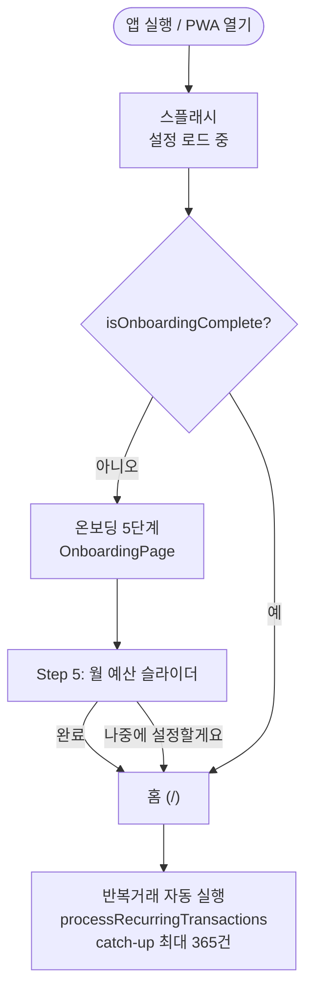
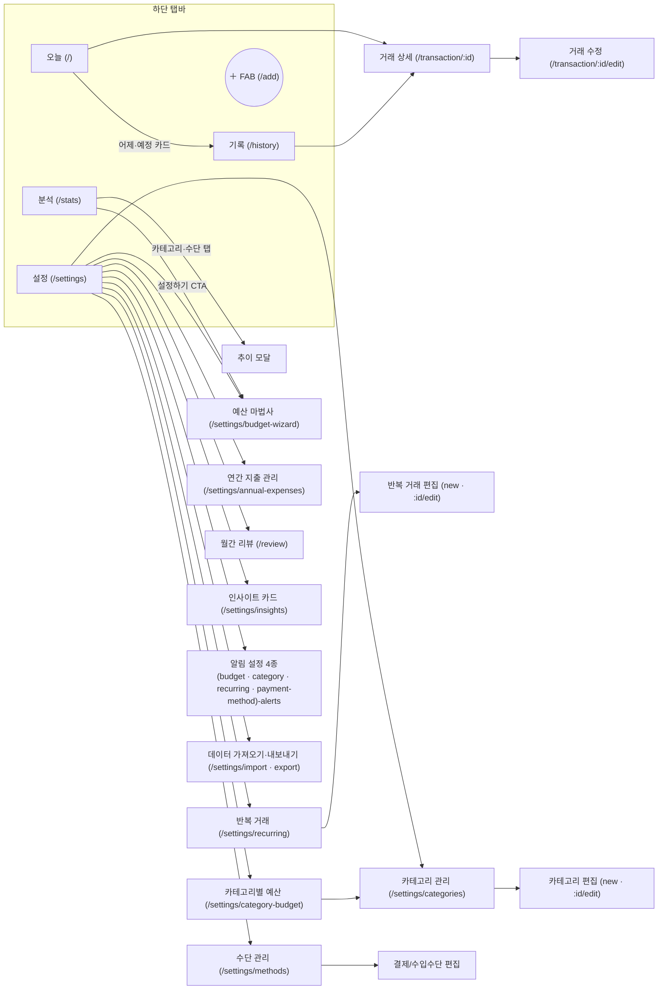
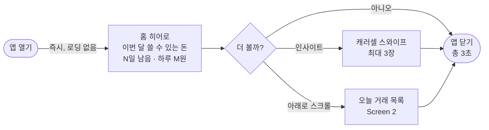
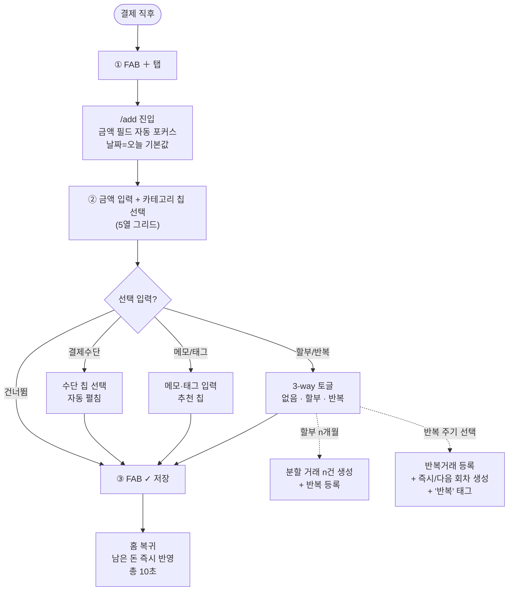
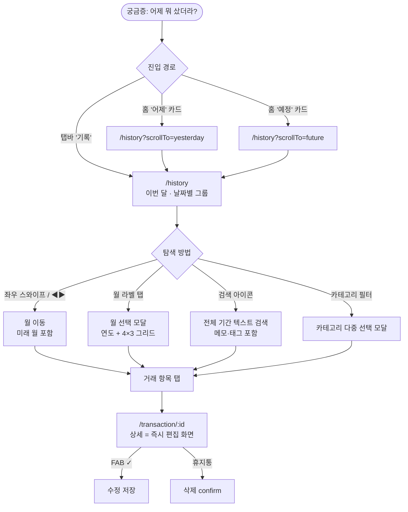
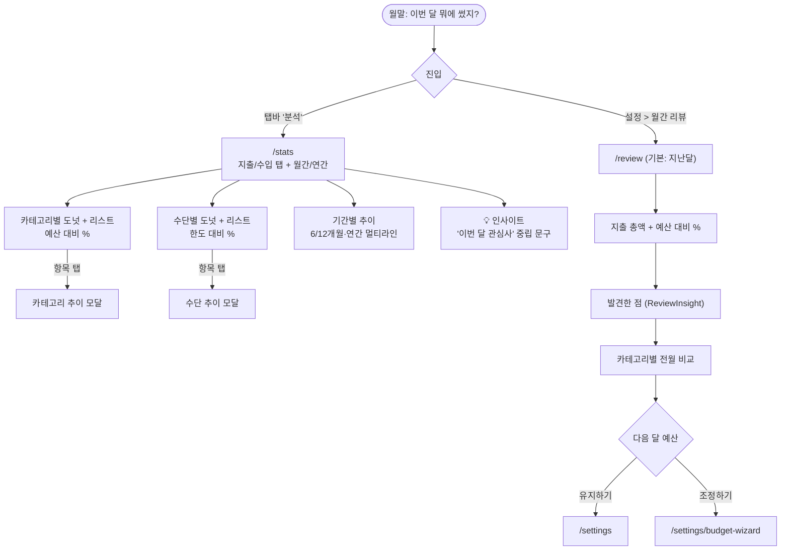
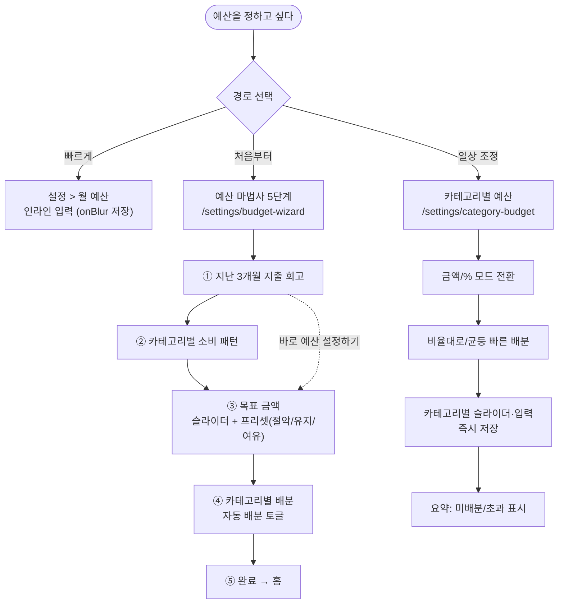
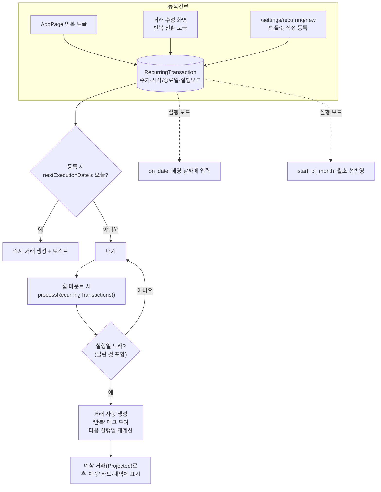
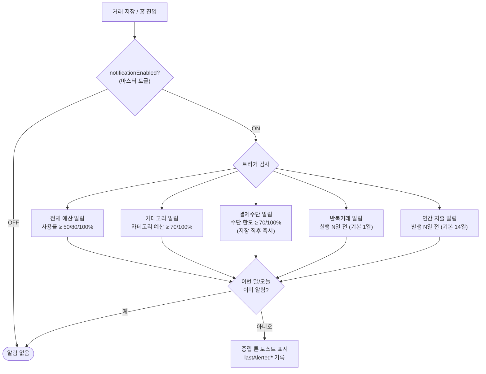
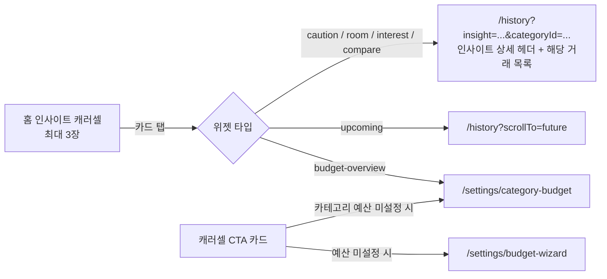

# PinPig 유저 플로우

> **문서 버전**: 1.0 | **작성일**: 2026-07-16 | **기준 앱 버전**: v0.2.5
> 문서 세트: [01 기획서](./01_PRD.md) · [02 기능 정의서](./02_REQUIREMENTS.md) · **03 유저 플로우** · [04 와이어프레임](./04_WIREFRAMES.md)
> 다이어그램은 Mermaid. 노드 괄호 안 경로는 실제 라우트(`src/App.tsx`).

---

## 1. 앱 진입 게이트

앱 실행 시 온보딩 완료 여부로 분기한다. 온보딩은 라우터 밖에서 렌더되는 전체 화면 게이트다.

**온보딩 스텝**: ① 웰컴("오늘 얼마나 쓸 수 있지?") → ② 홈 기능 소개 → ③ 3터치 기록 소개 → ④ 분석 소개 → ⑤ 예산 설정(슬라이더 50만~500만, 스킵 가능)

---

## 2. 정보 구조 (내비게이션 맵)

하단 탭바 5개(중앙 FAB 포함)가 최상위. 설정이 관리 화면들의 허브다.

---

## 3. 핵심 플로우 ① — 1초 확인 (가장 빈번, 하루 3~5회)

- 입력·터치 없이 정보 획득이 완결되는 것이 설계 목표 (NFR-1)
- 예산 미설정/거래 없음 등 상태별로 히어로·캐러셀이 CTA로 대체됨 (04 와이어프레임 참조)

---

## 4. 핵심 플로우 ② — 3터치 기록 (하루 2~5회)

AddPage는 아코디언 구조로, 선택을 마치면 다음 섹션이 자동으로 펼쳐진다. 저장 버튼은 화면 하단 중앙 FAB(✓)이다.

**유효성**: 금액 0 또는 카테고리 미선택이면 FAB 비활성 → 저장 불가.
**수입 기록**: 헤더 지출/수입 토글 → 수입 카테고리·수입수단으로 전환, 저장 시 `+` 녹색 표시.

---

## 5. 핵심 플로우 ③ — 내역 확인·검색 (하루 0~2회)

---

## 6. 핵심 플로우 ④ — 월말 리뷰 (월 1~2회)

---

## 7. 예산 설정 3경로

---

## 8. 반복거래 라이프사이클 (시스템 플로우)

---

## 9. 알림 트리거 플로우

---

## 10. 인사이트 → 상세 연결

홈 캐러셀 카드는 URL 파라미터(`insight`, `categoryId`, `month`)로 맥락을 전달하며 상세 화면으로 연결된다.

---

## 부록: 플로우별 빈도·소요시간 목표

| 플로우 | 빈도 | 목표 소요 | 터치 수 |
|--------|------|----------|---------|
| 1초 확인 | 하루 3~5회 | 3초 | 0 |
| 3터치 기록 | 하루 2~5회 | 10~15초 | 3 (+선택 입력) |
| 내역 확인 | 하루 0~2회 | 30초 | 2~4 |
| 월말 리뷰 | 월 1~2회 | 1~2분 | 3+ |
| 예산 설정(마법사) | 월 0~1회 | 2~3분 | 10+ |
